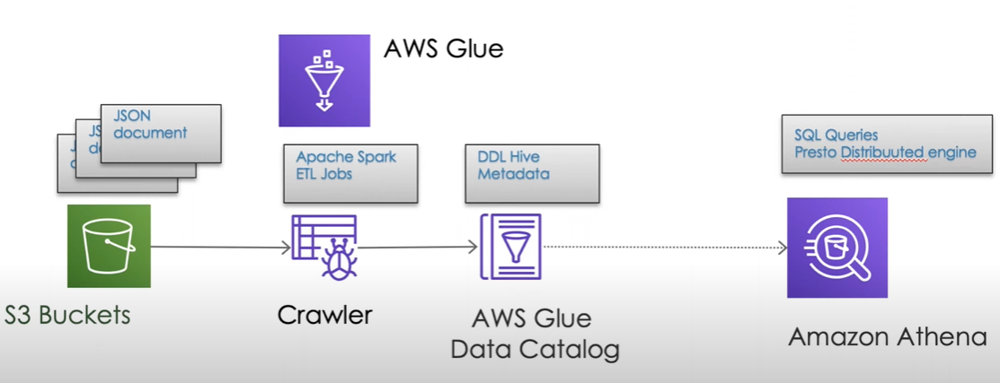
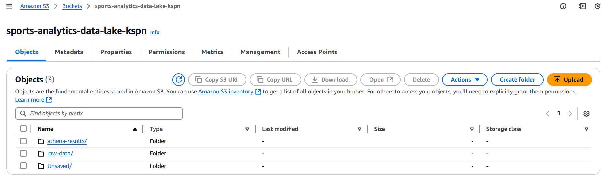
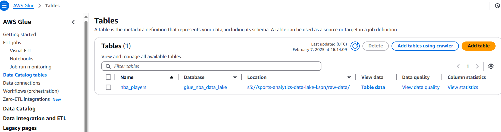
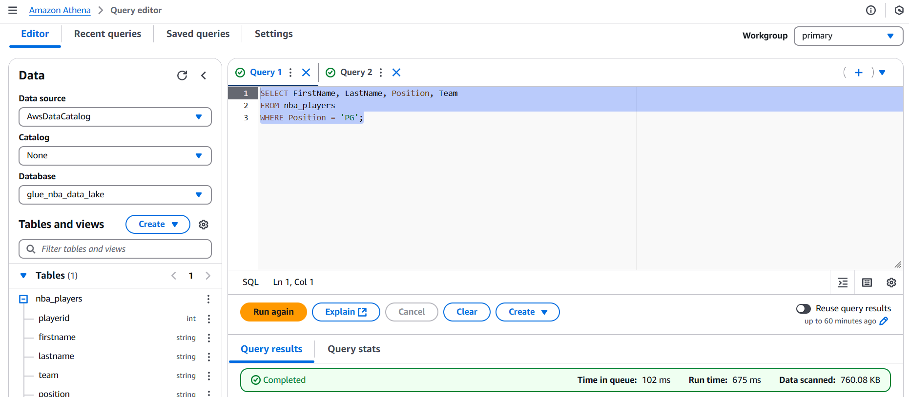
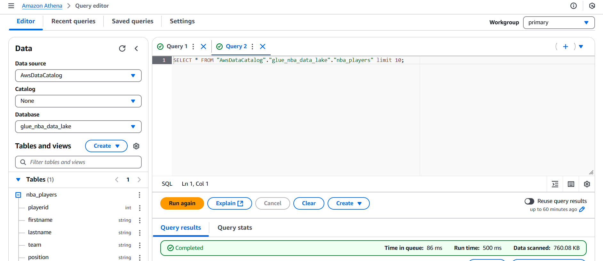

# Project Architecture

# AWS Services

** S3 Bucket ** - Storage layer for our datalake, holds raw unprocessed data in different formats like csv, json.

** Glue ** - Serverless data integration service thats going to catalog the data stored in s3 and enables schema definitions for querying with tools like Athena. its going to create a metadata layer or schema and table fore the S3 data to make it queriable.

Think of glue - hols things together.
glue crawler is going into our s3 bucket and get this unprocessed data and take it to athena.

Athena - Start querying data instantly.
interactive query service, allow users to query data thats stored in s3

### AWS S3:

### AWS Glue:

### Athena Queries:

#### Query-1:

SELECT FirstName, LastName, Position, Team
FROM nba_players
WHERE Position = 'PG';

#### Query-2:

SELECT \* FROM "AwsDataCatalog"."glue_nba_data_lake"."nba_players" limit 10;

